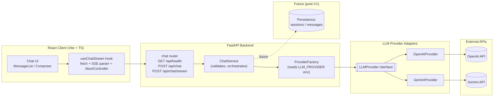

# Basic Chatbot (React + FastAPI)

A full-stack streaming chatbot project with:

- Frontend: React + TypeScript + Vite
- Backend: FastAPI (Python)
- LLM providers: OpenAI and Gemini (switchable via environment variables)

Current status after Phases 7-10:

- Stream interruption handling with inline Retry UI
- Typed backend error envelopes and SSE error frames
- Request-size and schema validation on the backend
- Backend and frontend automated test coverage for the main chat flow
- Gemini provider support behind the same backend and frontend contracts
- Deployment runbook and prerequisite checklist documented for Render + Vercel

## Repository Structure

- `backend/` - FastAPI API server and provider adapters
- `frontend/` - React client with streaming UI
- `docs/` - planning notes (ignored by git in this repo setup)

## Features

- Non-streaming endpoint: `POST /api/chat`
- Streaming SSE endpoint: `POST /api/chat/stream`
- Health endpoint: `GET /api/health`
- Provider abstraction: switch between OpenAI/Gemini without frontend changes
- Stop/cancel while streaming
- Retry after interrupted streams
- Standardized error handling for validation, timeout, and provider failures

## System Design Diagram



## Prerequisites

- Python 3.12+
- [uv](https://docs.astral.sh/uv/)
- Node.js 20+ (24 works)
- npm

## Quick Start

### 1) Backend

```bash
cd backend
cp .env.example .env
# Fill in API keys in .env
uv sync
uv run uvicorn app.main:app --reload --port 8000
```

### 2) Frontend

```bash
cd frontend
cp .env.example .env
npm install
npm run dev
```

Frontend default URL: `http://localhost:5173`

Backend default URL: `http://localhost:8000`

Before running locally, make sure the selected backend provider has a real API key in `backend/.env`.

## Provider Switching

In `backend/.env`:

- `LLM_PROVIDER=openai` or `LLM_PROVIDER=gemini`
- set provider-specific key/model values

Examples:

```dotenv
LLM_PROVIDER=openai
OPENAI_MODEL=gpt-4o-mini
```

```dotenv
LLM_PROVIDER=gemini
GEMINI_MODEL=gemini-3.1-flash-lite
```

Then restart backend.

## API Overview

### Health

```http
GET /api/health
```

Example response:

```json
{
  "status": "ok",
  "provider": "gemini",
  "version": "0.1.0"
}
```

### Non-streaming chat

```http
POST /api/chat
Content-Type: application/json
```

Body:

```json
{
  "messages": [{ "role": "user", "content": "What is FastAPI?" }]
}
```

### Streaming chat (SSE)

```http
POST /api/chat/stream
Content-Type: application/json
```

Returns `text/event-stream` with frames: `start`, `delta`, `end`, and `error`.

## Development Commands

### Backend

```bash
cd backend
make run
make lint
make format
make format-check
make test
uv run pytest
```

### Frontend

```bash
cd frontend
npm run test
npm run lint
npm run format
npm run format:check
npm run build
npm test -- --run
```

## Reliability Notes

- Non-streaming failures return a standard JSON error envelope with codes such as `validation_error`, `provider_timeout`, `provider_rate_limited`, `provider_error`, and `internal_error`.
- Streaming failures surface as SSE `error` frames with the same error codes.
- The frontend preserves partial assistant output on interruption, marks the message as interrupted, and offers Retry.
- Oversized or malformed requests are rejected before hitting the provider.

## Tests

Backend coverage includes:

- health endpoint
- non-streaming chat success and error normalization
- streaming SSE frame sequencing and cancellation behavior
- Gemini provider adapter and env-driven provider selection

Frontend coverage includes:

- SSE parser behavior across chunk boundaries
- reducer state transitions
- composer-driven streaming and Stop behavior

Recommended validation commands:

```bash
cd backend && uv run pytest
cd frontend && npm test -- --run
cd frontend && npm run build
```

## Deployment Status

Deployment prerequisites and the operator runbook are documented in [docs/plans/chatbot-v1.md](docs/plans/chatbot-v1.md). Actual Render/Vercel deployment is still a manual step because it requires:

- a connected Git remote
- Render and Vercel accounts
- production env vars and provider secrets
- manual CORS and public-URL validation

## Notes

- Keep API keys in local `.env` files only.
- Rotate keys immediately if exposed.
